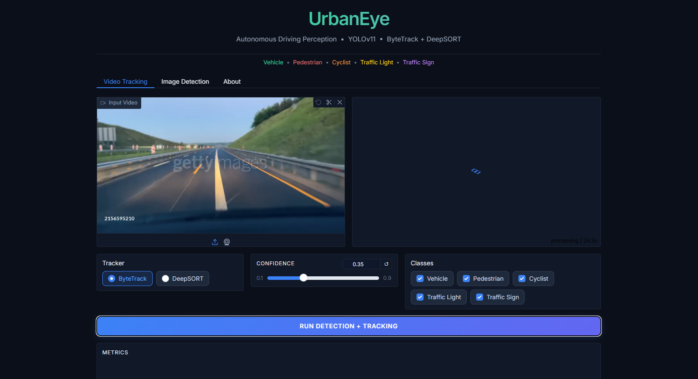
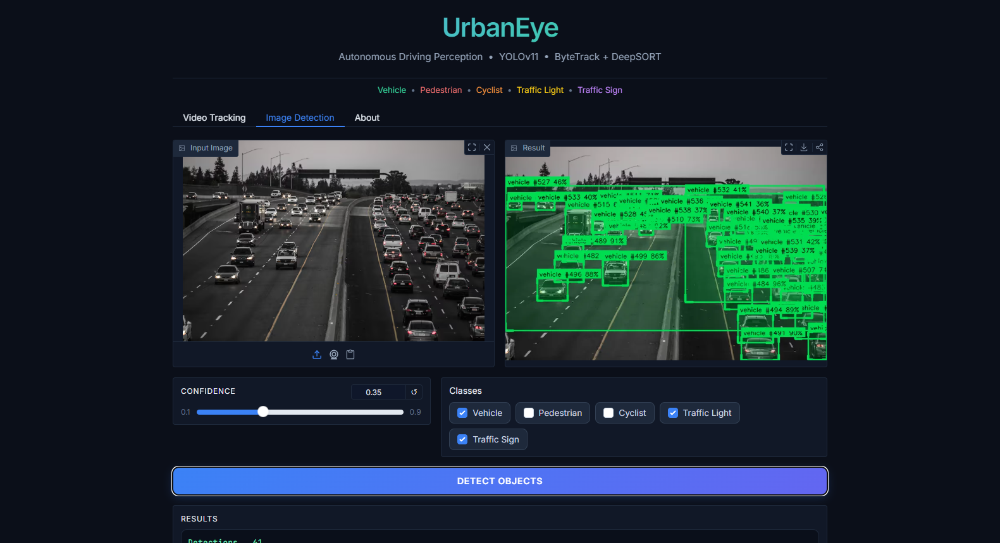
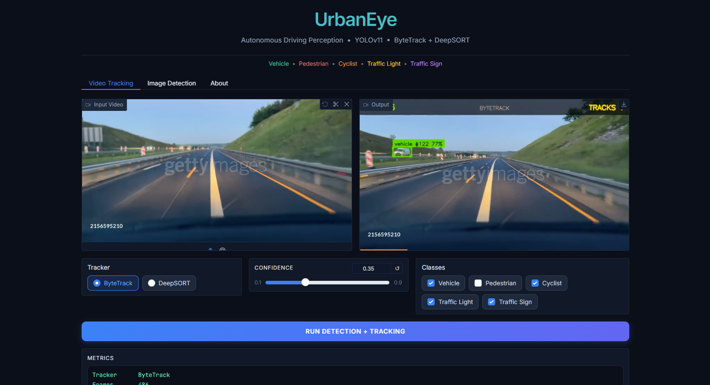
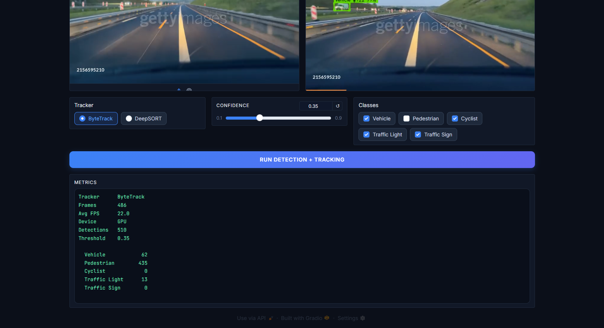
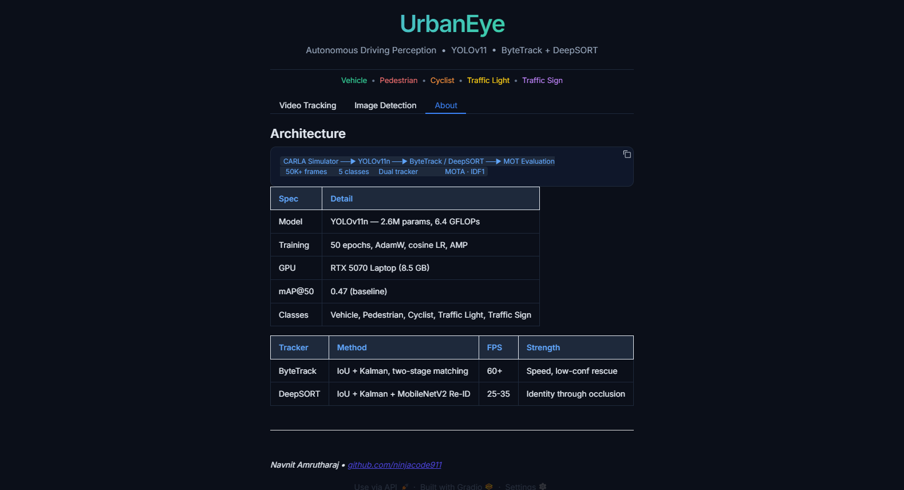

<div align="center">

# UrbanEye

**Autonomous Driving Perception Pipeline — Zero Hardware, Zero Cost**

*Full AV perception from synthetic data generation to real-time multi-object tracking, built entirely on free infrastructure.*

[](https://www.python.org/)
[](https://docs.ultralytics.com/)
[](https://carla.org/)
[](tests/)
[](https://huggingface.co/spaces/NinjainPJs/UrbanEye)
[](LICENSE)

[**Live Demo →**](https://huggingface.co/spaces/NinjainPJs/UrbanEye)&nbsp;&nbsp;|&nbsp;&nbsp;[**Documentation →**](docs/)&nbsp;&nbsp;|&nbsp;&nbsp;[**Architecture →**](docs/ARCHITECTURE.md)&nbsp;&nbsp;|&nbsp;&nbsp;[**Phase Log →**](docs/PHASES.md)

</div>

---

## Overview

UrbanEye is a complete autonomous driving perception pipeline that generates synthetic training data from CARLA simulator, trains YOLOv11 to detect 5 urban driving classes (vehicle, pedestrian, cyclist, traffic light, traffic sign), and tracks objects in real-time using a dual-tracker system combining ByteTrack (60+ FPS) and DeepSORT (identity-persistent Re-ID). The entire system runs on Kaggle free T4 GPUs and deploys on HuggingFace Spaces — zero hardware, zero cost.

The project implements the same methodology used by Waymo, Cruise, and Mobileye research teams — synthetic data generation, domain adaptation, multi-object tracking with MOT evaluation — rebuilt entirely with open-source tools.

**What makes this different from typical object detection demos:**
- **Simulation-first data pipeline** — CARLA generates 50K+ auto-annotated frames across 144 scenario configs (8 maps x 6 weather x 3 time-of-day), eliminating manual labeling entirely.
- **3-layer domain adaptation** — weather randomization + Albumentations augmentation + BDD100K mixed training bridges the sim-to-real gap.
- **From-scratch ByteTrack** — custom Kalman Filter + Hungarian Algorithm implementation, not a library wrapper. Two-stage matching rescues low-confidence occluded detections.
- **Research-grade evaluation** — standard MOT Challenge metrics (MOTA, MOTP, IDF1, ID Switches) with per-class breakdown, not just visual demos.
- **Dual tracker comparison** — ByteTrack vs DeepSORT side-by-side on identical sequences with quantitative comparison.

---

## Architecture

```
  CARLA Simulator (WSL2 + GPU)
    |
    v
  +-------------------------------+
  |  Stage 1: Data Generation      |  8 maps x 6 weather x 3 time
  |  Ego vehicle + multi-sensor    |  50K+ YOLO-annotated frames
  |  ScenarioRunner edge cases     |  Pedestrian, weather, emergency
  +---------------+---------------+
                  |
                  v
  +-------------------------------+
  |  Stage 2: Model Training       |  YOLOv11n/m on Kaggle T4
  |  Albumentations augmentation   |  Domain adapt: CARLA 80% + BDD100K 20%
  |  ONNX export for deployment    |  Cosine LR, AMP, class weights
  +---------------+---------------+
                  |
                  v
  +-------------------------------+
  |  Stage 3: Dual Tracking        |
  |  +----------+ +-------------+ |
  |  | ByteTrack| | DeepSORT    | |  ByteTrack: 60+ FPS, IoU+Kalman
  |  | 2-stage  | | Re-ID       | |  DeepSORT: 25-35 FPS, MobileNetV2
  |  | matching | | appearance  | |
  |  +----------+ +-------------+ |
  +---------------+---------------+
                  |
                  v
  +-------------------------------+
  |  Stage 4: Evaluation + Demo    |  MOTA, MOTP, IDF1, ID Switches
  |  MOT metrics + report gen      |  Gradio UI on HuggingFace Spaces
  |  Per-class breakdown           |  Video upload -> annotated output
  +-------------------------------+
```

---

## Features

| Feature | Detail |
|---------|--------|
| **Synthetic Data Engine** | CARLA 0.9.15 with synchronized RGB + depth + semantic sensors, auto YOLO annotation export |
| **Scenario Runner** | Scriptable edge cases: pedestrian jaywalking, adverse weather cycling, emergency vehicles |
| **5-Class Detection** | Vehicle, pedestrian, cyclist, traffic light, traffic sign with class-weighted training |
| **Domain Adaptation** | 3-layer strategy: weather randomization, Albumentations pipeline, BDD100K mixed fine-tuning |
| **ByteTrack (Custom)** | From-scratch implementation with Kalman Filter, Hungarian Algorithm, two-stage matching |
| **DeepSORT Integration** | MobileNetV2 Re-ID features for identity persistence through long occlusions |
| **DualTracker Interface** | Unified API switching between ByteTrack and DeepSORT with identical TrackedObject output |
| **MOT Evaluation** | MOTA, MOTP, IDF1, ID Switches with per-class breakdown and automated report generation |
| **Interactive Demo** | Gradio app with video upload, tracker selection, confidence slider, class filters |
| **GPU Auto-Detection** | Automatic CPU fallback when GPU architecture is unsupported by installed PyTorch |

---

## Tech Stack

| Layer | Technology | Purpose |
|-------|-----------|---------|
| **Simulation** | CARLA 0.9.15 | Photorealistic AV simulator with Python API |
| **Detection** | YOLOv11 (Ultralytics) | Multi-class object detection, ONNX export |
| **Training** | Kaggle T4 GPU / RTX 5070 | Free cloud or local GPU training |
| **Augmentation** | Albumentations | Domain adaptation: noise, blur, rain, fog, sun flare |
| **Transfer Data** | BDD100K (UC Berkeley) | 100K real-world driving images for fine-tuning |
| **Tracking** | ByteTrack (custom) + DeepSORT | Real-time and identity-persistent MOT |
| **Evaluation** | motmetrics / TrackEval | Standard MOT Challenge metrics |
| **Demo** | Gradio 4.x + HuggingFace Spaces | Interactive inference UI |
| **Video I/O** | OpenCV + FFmpeg | Frame processing, H.264 encoding |
| **CI** | GitHub Actions | Lint (ruff) + test (pytest) on Python 3.11/3.12 |

---

## Project Structure

```
urbaneye/
├── carla/                    # CARLA data generation engine
│   ├── sensor_config.py      # Camera/simulation dataclasses
│   ├── annotation_exporter.py # 3D->2D projection, YOLO format
│   ├── data_generator.py     # Ego vehicle driving + capture loop
│   └── scenario_runner/      # Edge case scenarios (3 scripts)
├── training/                 # YOLOv11 training pipeline
│   ├── train_yolov11.py      # TrainConfig + Ultralytics launcher
│   ├── augmentations.py      # 3-level Albumentations pipeline
│   └── domain_adapt.py       # BDD100K adapter + mixed dataset
├── tracking/                 # Dual tracker system
│   ├── kalman_filter.py      # From-scratch Kalman Filter (8D state)
│   ├── bytetrack_pipeline.py # Custom ByteTrack with 2-stage matching
│   ├── deepsort_pipeline.py  # DeepSORT wrapper (lazy-init)
│   ├── dual_tracker.py       # Unified DualTracker interface
│   └── utils.py              # IoU, Hungarian Algorithm, bbox conversions
├── evaluation/               # MOT metrics + report generation
│   ├── mot_evaluator.py      # MOTA, MOTP, IDF1, ID Switches
│   ├── detection_evaluator.py # mAP@50, per-class AP
│   └── generate_report.py    # Markdown report generator
├── demo/                     # Gradio demo application
│   ├── app.py                # Video processing + frame annotation
│   └── index.html            # Standalone frontend (GSAP + WebGL)
└── utils/                    # Shared utilities
    ├── constants.py           # 5 classes, colors, thresholds
    ├── io_helpers.py          # YAML loading, path utilities
    └── visualization.py       # Bbox drawing, dataset stats
tests/
├── unit/                     # 263 unit tests (one per module)
└── integration/              # 7 end-to-end pipeline tests
hf_space/                     # HuggingFace Spaces deployment
scripts/                      # Dataset preparation + training scripts
configs/                      # Project-wide configuration
docs/                         # Architecture, phase logs, guides
```

---

## Quick Start

### Prerequisites
- Python 3.11+ ([python.org](https://www.python.org/downloads/))
- CARLA 0.9.15 on WSL2 (only for data generation — not required to run the demo)

### 1. Clone and install
```bash
git clone https://github.com/ninjacode911/Project-UrbanEye.git && cd Project-UrbanEye
pip install -e ".[dev]"
```

### 2. Install training dependencies (optional)
```bash
pip install -e ".[training]"   # ultralytics, albumentations
pip install -e ".[tracking]"   # deep-sort-realtime, scipy
pip install -e ".[demo]"       # gradio, onnxruntime
```

### 3. Run the demo
```bash
python hf_space/app.py
```

### 4. Use it
1. Open `http://localhost:7860` in your browser
2. Upload a dashcam video (MP4, AVI, MOV)
3. Select tracker (ByteTrack or DeepSORT), adjust confidence
4. Click **Run Detection + Tracking**
5. View annotated output with detection metrics

---

## Running Tests

```bash
# All tests (270)
pytest tests/ -v --timeout=60

# Unit tests only
pytest tests/unit/ -v

# Single test file
pytest tests/unit/test_bytetrack.py -v

# Lint + format
ruff check . && ruff format --check .
```

---

## Configuration

| Variable | Default | Description |
|----------|---------|-------------|
| `detection.confidence_threshold` | 0.25 | Minimum detection confidence |
| `detection.nms_iou_threshold` | 0.45 | NMS IoU threshold |
| `detection.img_size` | 640 | Input image resolution |
| `tracking.bytetrack.high_thresh` | 0.6 | Stage 1 confidence threshold |
| `tracking.bytetrack.low_thresh` | 0.1 | Stage 2 confidence threshold |
| `tracking.bytetrack.max_lost` | 30 | Frames before track deletion |
| `tracking.deepsort.max_age` | 70 | Frames before track deletion |
| `tracking.deepsort.max_cosine_distance` | 0.3 | Re-ID matching threshold |

See `configs/project_config.yaml` for all settings.

---

## Screenshots

<div align="center">











</div>

---

## License

**Source Available — All Rights Reserved.** See [LICENSE](LICENSE) for full terms.

The source code is publicly visible for viewing and educational purposes. Any
use in personal, commercial, or academic projects requires explicit written
permission from the author.

To request permission: navnitamrutharaj1234@gmail.com

**Author:** Navnit Amrutharaj
